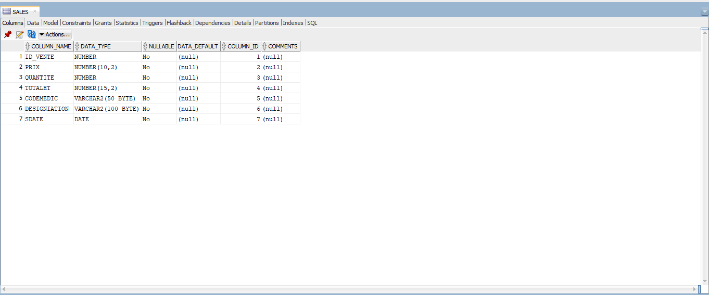

# PharMease

**PharMease** is a smart pharmacy management system developed by **DEVXperts**. The application is designed to streamline pharmacy operations, providing a user-friendly interface for managing medications, prescriptions, and customer orders. Built using the **Qt framework** with a **C++** backend, and leveraging **SQL** for database management, PharMease ensures a smooth, efficient workflow for both pharmacists and customers.

## Features
- **Medication Management**: Easily add, update, and delete medication records.
- **Prescription Handling**: Manage customer prescriptions with quick access to medication details.
- **Order Management**: Keep track of customer orders and inventory levels.
- **User Authentication**: Secure login for pharmacists and administrators.
- **Reports & Analytics**: Generate reports on medication sales and inventory trends.

## Technology Stack
- **Frontend**: Developed using **Qt Designer** for a modern and responsive user interface.
- **Backend**: Implemented in **C++** for efficient performance and robust logic handling.
- **Database**: Data is managed using **SQL**, ensuring reliable and secure data storage.
- **Scripting & Automation**: Utilized Python for automation tasks such as sending mail verifications and resetting passwords.
- **Hardware Integration**: Integrated an Arduino with an RFID system to automate user logins, enhancing system functionality and security.

## Installation

1. **Clone the repository**:
   ```bash
   git clone https://github.com/yourusername/pharmease.git
2. **Create Database in your Pc**:   
   check connection.cpp and create a database
   open sql developers and do the following:
   -create tables here's screenshots
   
   
   
   
   
   

   
3. **Run The Application**:  
   open .pro file and run
   enjoy.   
   
